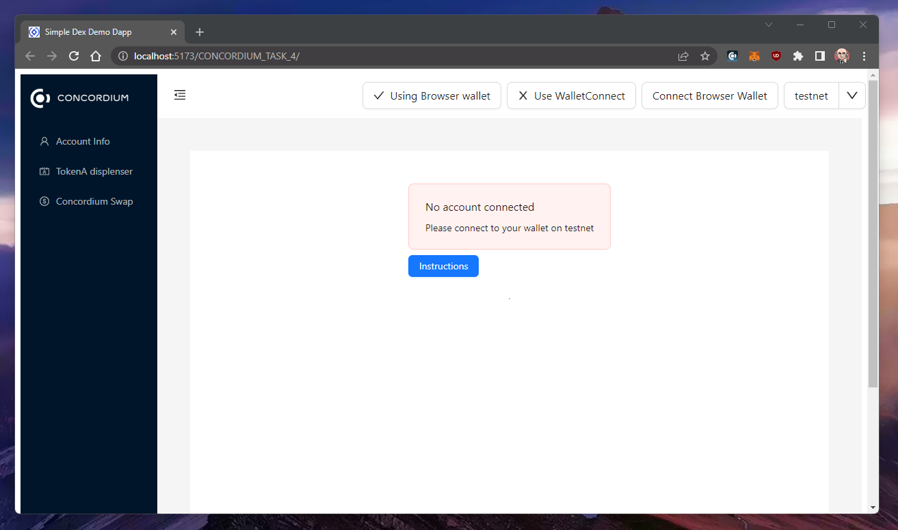
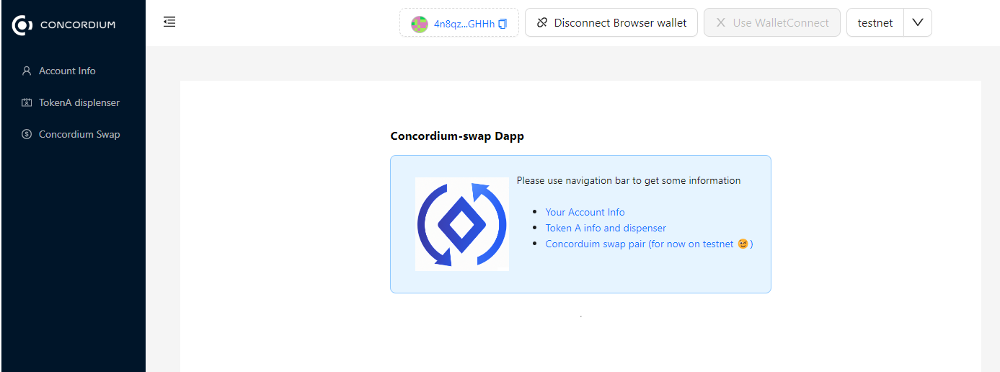
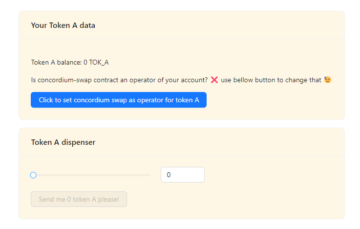
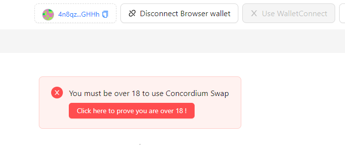
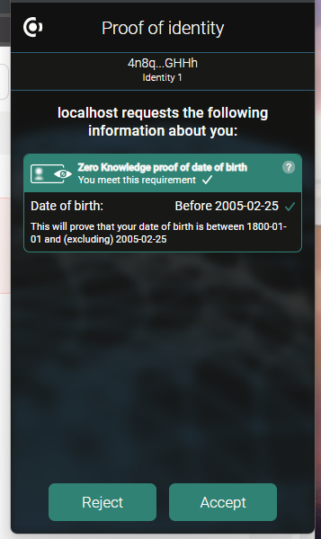
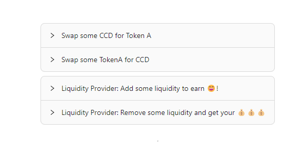
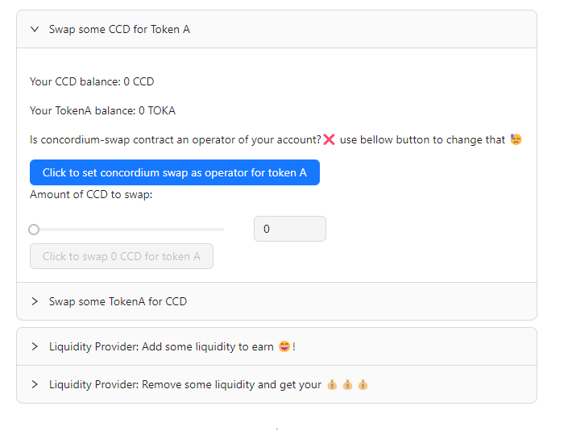
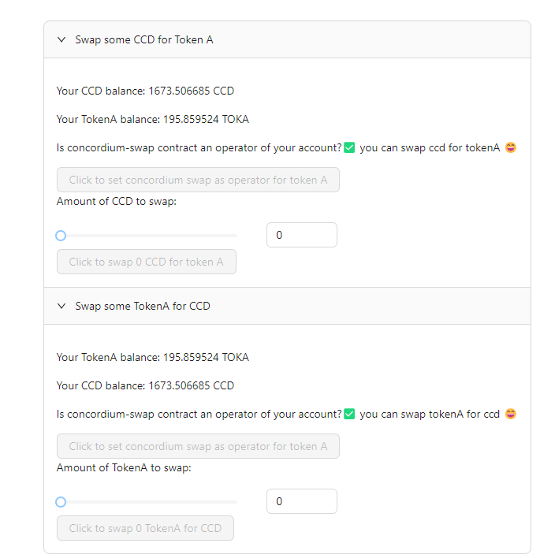
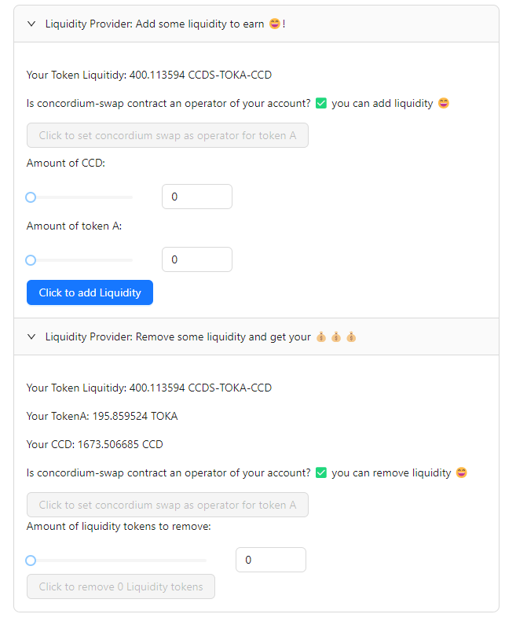

### Hackathon: Concordium Hackathon - The Future of Identity
# TASK 4: Building The Future Of ID

# Task description
Building the future of identity. Create the next generation of use cases that have ID, privacy, and accountability at their core.

# Concordium Mainnet address

`4Fo1erxUgLt7wDvaoUgxxBbV3rquCWZmnzGnDA2DUzv6FFqAKk`

# Acceptance Criteria
- [x] brief README file with instructions on how to run the dApp + your Concordium mainnet address for payout.
- [x] Add a clear description of what the dApp does and how to use it (including valid input).
- [x] Add gif/video showing the dApp in use.

Link to the [Gitcoin issue 29744](https://gitcoin.co/issue/29744)


# ConcordiumSwap Dapp

## Dapp description

ConcordiumSwap is simple DEX DApp running on the Concordium Chain (testnet for now).This DApp includes an over 18 check to ensure compliance with local regulations.

The DApp uses a Uniswap V2-style automated market maker (AMM) model, which employs a constant k value formula for liquidity provision. This means that liquidity is provided by users depositing equal values of two tokens, which are then used to set the price of the token pair based on the ratio of the amounts deposited.

The DApp charges a fee (0.2% for providers 0.1% for protocol = 0.3% total) for trades, which is distributed to liquidity providers in proportion to their contribution. Users can swap tokens by selecting the token pair they wish to trade and specifying the amount they want to exchange. The DApp automatically calculates the exchange rate based on the current liquidity and executes the trade.

Overall, this DApp provides a simple and decentralized way for users to trade tokens, with an over 18 check and a fee distribution system that incentivizes liquidity provision.

## Dapp demo 

### Implementattion [testnet only]
- ccd-swap [contract here](./concordium-swap/src/lib.rs).
```json
{"index":3430,"subindex":0}
```
- a token with a dispenser called tokenA [contract here](./cis2-tokens/src/lib.rs)
```json
{"index":3389,"subindex":0}
```
see [cis2 token deploy script](./testnet_cis2_tokens.ps1)
and [ccd swap script](./testnet_swap.ps1)

For details on how to init a contract for your own tokens.

### Set up localy

```console
cd .\concordium-swap-dapp\
npm i
npm run dev
```

Dapp should run localy at http://localhost:5173/CONCORDIUM_TASK_4/

### Demo deployed
Just go there and test the app
https://nabetse00.github.io/CONCORDIUM_TASK_4/

# Usage

## video demonstration

See this [video](https://www.youtube.com/watch?v=AAUd10IJlPM)

## Screenshots




















